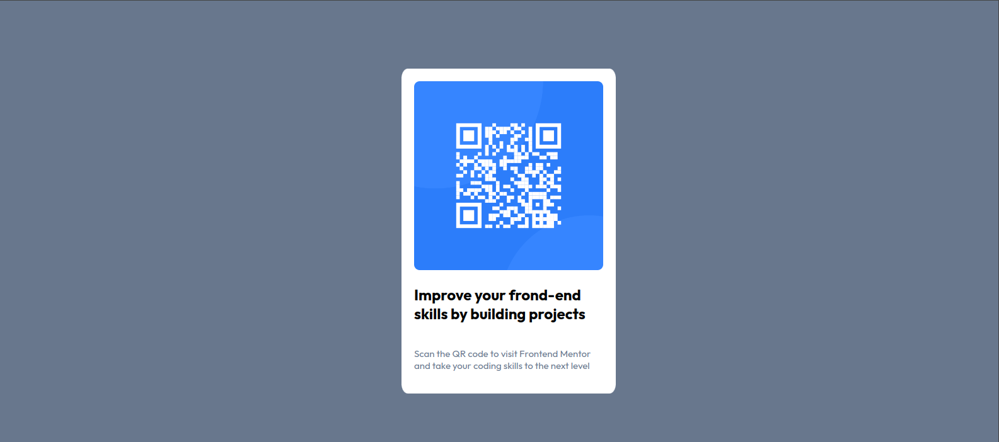

# Frontend Mentor - QR code component solution

This is a solution to the [QR code component challenge on Frontend Mentor](https://www.frontendmentor.io/challenges/qr-code-component-iux_sIO_H). Frontend Mentor challenges help you improve your coding skills by building realistic projects. 

## Table of contents

- [Overview](#overview)
  - [Solution Screenshot](#solution-screenshot)
  - [Links](#links)
- [My process](#my-process)
  - [Built with](#built-with) 
- [Author](#author)

## Overview

### Solution screenshot

### Links

- [Solution URL](https://github.com/gaboneweb/qr-code)
- [Live Site URL](https://front-end-mentor-qr-code-bg.netlify.app/)

## My process

### Built with

- Semantic HTML5 markup
- Flexbox

## Author

- Website - [Bulelani Gabonewe](https://www.your-site.com)
- Frontend Mentor - [gaboneweb](https://www.frontendmentor.io/profile/gaboneweb)
- Linkedin - [bulelani-gabonewe](https://www.linkedin.com/in/bulelani-gabonewe)

